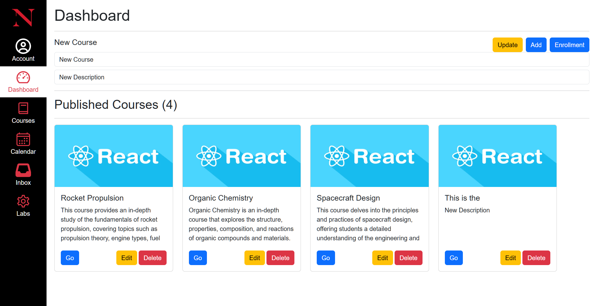
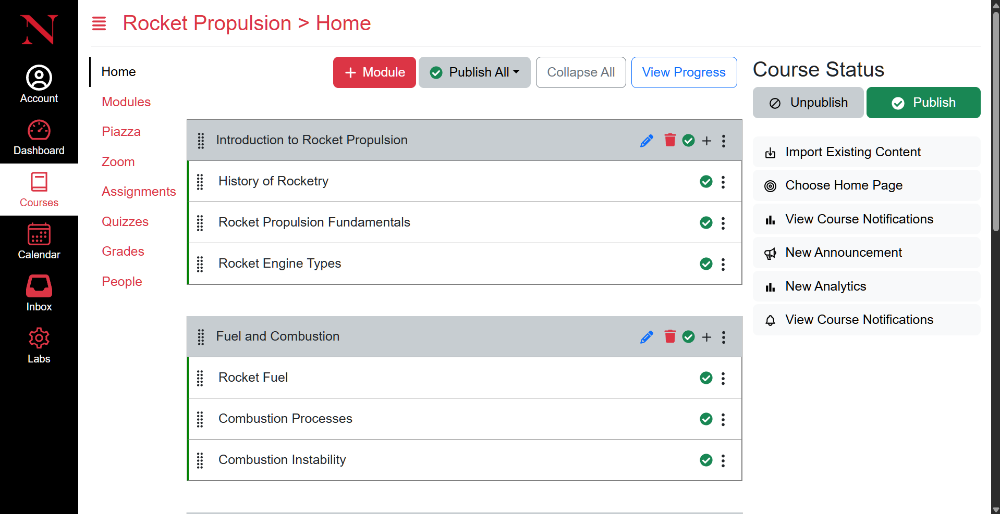
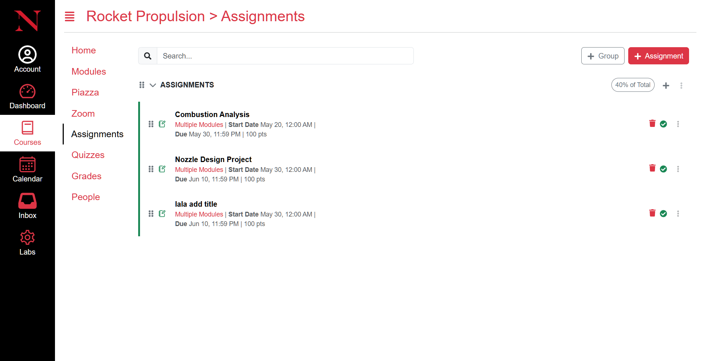
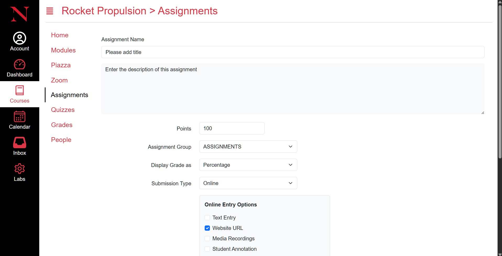

# Kambaz - Canvas LMS Clone


> A full-stack Learning Management System built to understand the architecture behind educational platforms like Canvas.

## 📋 What I Built

A complete LMS featuring:
- 📚 Course management with hierarchical structure
- 📝 Assignment creation and submission
- 👥 Role-based access control (Faculty vs Students)
- 🔐 Session-based authentication
- 📊 User enrollment and management

## 🛠️ Tech Stack

**Frontend**
- React 18 with TypeScript
- Vite for build tooling
- Modern component architecture

**Backend**
- Node.js with Express 5
- MongoDB with Mongoose ODM
- Session management with express-session
- RESTful API design

**Deployment**
- Frontend: Netlify
- Backend: Render
- Database: MongoDB Atlas

## 💡 What I Learned

- Building complex hierarchical data structures (courses → modules → assignments)
- Implementing role-based access control from scratch
- Managing authentication state across distributed systems
- Coordinating deployment across multiple platforms
- Full-stack TypeScript development best practices

## 🎯 Key Features

### For Faculty
- Create and manage courses
- Add modules and assignments
- Manage student enrollments
- View student submissions

### For Students
- Browse available courses
- View assignments and due dates
- Submit coursework
- Track progress

## 📸 Screenshots

[Add 2-3 screenshots of key interfaces]
Dashboard

Course (Default Modules view)

Assignment list view

Assignment view


## 🚀 Running Locally

### Backend 
**Backend Repo:**[https://github.com/jaiminsavaliya316/kambaz-server-jaimin]
```bash
cd kambaz-server-jaimin
npm install
# Create .env file (see .env.example)
npm start
```

### Frontend
```bash
cd kambaz-jaimin
npm install
npm run dev
```

## 🔗 Links

- **Frontend Repo:** [URL]
- **Backend Repo:** [URL]

## 📝 Project Context

Built as a full-stack portfolio project to demonstrate:
- MERN stack proficiency
- Complex state management
- Role-based authorization
- Cloud deployment skills

---

**💼 Want to see more of my work?** Check out my [portfolio](link) or connect on [LinkedIn](link).
